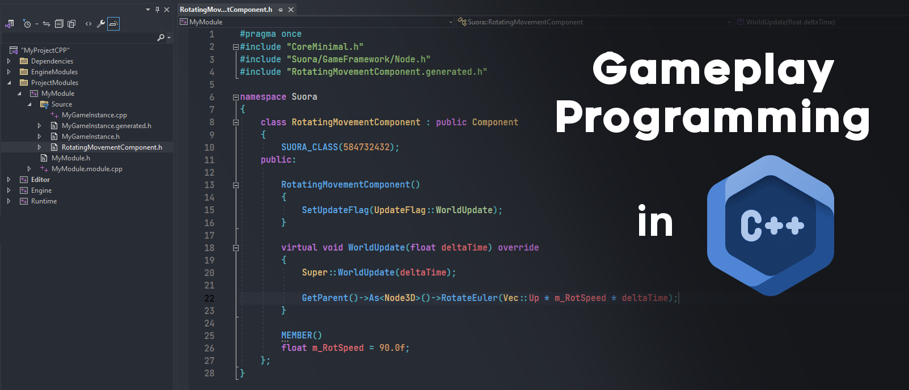
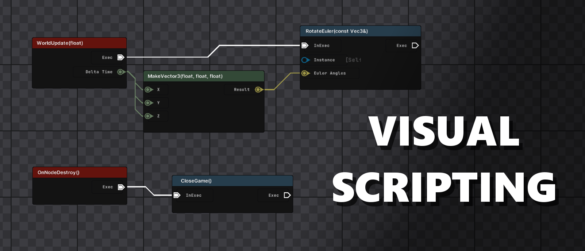
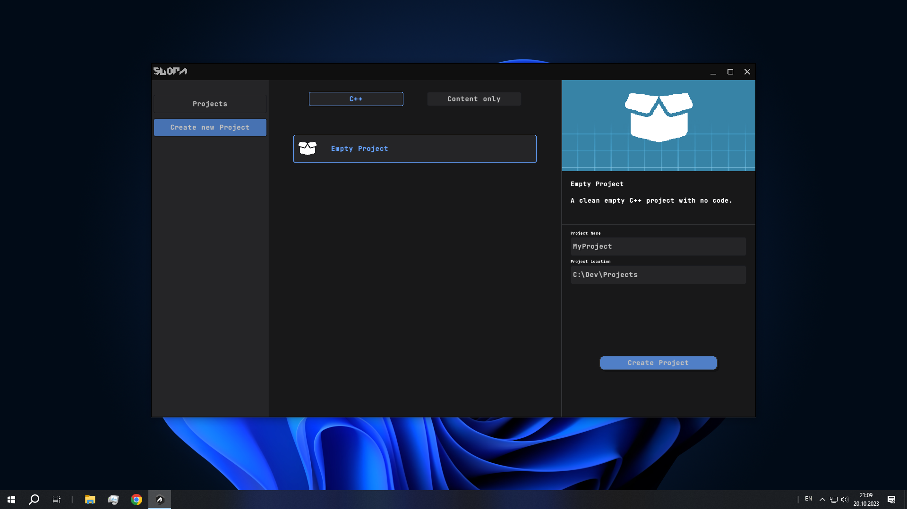

  

SuoraEngine is an open-source C++ Engine for building 3D real-time rendering and interactive Applications or Content, especially Video Games.

## Current Features
In its current state, Suora's most remarkable features are:

#### Gameplay Programming

Gameplay Programming using C++ and a custom C++ Reflection System using SuoraHeaderTool and SuoraBuildTool. Everything is devided into C++ Modules, which can be compiled incrementally.

#### Visual Scripting (Experimental)

Create custom Gameplay Logic using Visual Scripting. Easy interoperability with C++ using SuoraHeaderTool.

**Other Features Suora offers:**

| Feature                               | Description                                                                                                          |
| -------                               | -----------                                                                                                          |
| **Custom SuoraBuildTool**             | To extend the Engine using Modules as Plugins and to allow Reflection and Introspection                              |
| **Custom Visual Scripting Tools**     | Node-based Visual Scripting to enable easy implementation of custom logic                                            |
| **Physics**                           | 3D Physics using JoltPhysics                                                                                         |
| **GameFramework**                     | Flexible Node-based GameFramework                                                                                    |
| **Custom EditorUI**                   | using the RenderingAPI as a Backend (**Immediate**)                                                                  |
| **InGameUI**                          | using the GameFramework and UINodes (**Retained**)                                                                   |
| **Full Visual Editor**                | Feature complete Level- and Asset-Editor to enable authoring game content                                            |
| **Deferred Rendering**                | Deferred + Forward Rendering using scriptable Shaders                                                                |
| **Particle Systems**                  | using Instanced Rendering                                                                                            |

## Getting Started [Windows]
- Install Visual Studio 2022 and also install **Desktop Development with C++** using the Visual Studio Installer

- To create a new or open an existing Suora Project, start the Launcher in /Binaries/
- Choose a Project Name and Location and select **Create Project**

- Visual Studio should open by default
  - If not, open the Location in your File Explorer and use the Buildscripts in {ProjectLocation}/Scripts/
  - Open the .sln manually
- Choose **Editor** as your Startup Project and **Release** as your Configuration
- Compile and Run

## Build the Engine Yourself
- Clone the repository: git clone --recursive https://github.com/YanSchw/SuoraEngine
- Execute the Buildscript in /Binaries/Scripts/{...}
  - Or build SuoraBuildTool yourself in /Code/SuoraBuildTool
- Generate the Solution using /GenerateSolution.bat
- Open the Solution using Visual Studio 2022
- Build using VS2022

## Build Requirements
- C++20 Compiler
- [Windows] Visual Studio 2022 Toolset (**MSVC**)

## Supported Platforms
- Windows (64bit)
