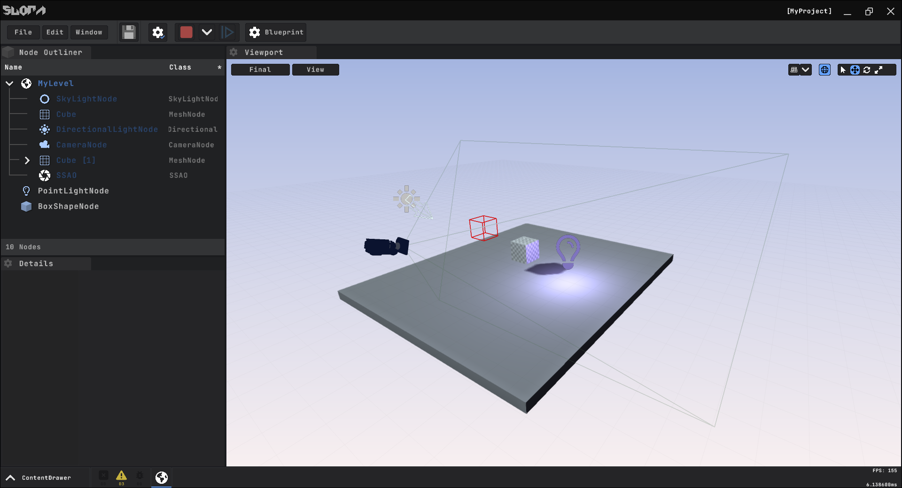

  

SuoraEngine is an open-source C++ Engine for building 3D real-time rendering and interactive Applications or Content, especially Video Games.

## Current Features
In its current state, Suora's most remarkable features are:

| Feature               | Description                              |
| -------               | -----------                              |
| **C++ Reflection**    | C++ Reflection using **SuoraHeaderTool** |
| **Physics**           | 3D Physics using JoltPhysics             |
| **GameFramework**     | Flexible Node-based GameFramework        |
| **Custom EditorUI**   | ... using the RenderingAPI as a Backend  |
| **Visual Scripting** (Experimental)   | Add custom Game Code using VisualScripting |

## Getting Started
- Install Visual Studio 2019 and also install **Desktop Development with C++** using the Visual Studio Installer
- To *create a new* or *open an existing* Suora Project, start the Launcher in /Binaries/
- Select a Project Name and Location and hit *Create*
- Visual Studio should open by default
  - If not, open the Location in your File Explorer and use the Buildscripts in {ProjectLocation}/Scripts/
  - Open the .sln manually
- Choose **Editor** as your Startup Project and **Release** as your Configuration
- Compile and Run

## Setup the Engine Project
- Clone the repository: git clone --recursive https://github.com/YanSchw/SuoraEngine
- Execute the Buildscript in /Binaries/Scripts/{...}
  - Or build SuoraBuildTool yourself in /Code/SuoraBuildTool
- Generate the Solution using /GenerateSolution.bat
- Open the Solution using Visual Studio 2019

## Build Requirements
- C++17 Compiler
- Visual Studio 2019 Toolset

## Supported Platforms
- Windows (64bit)
